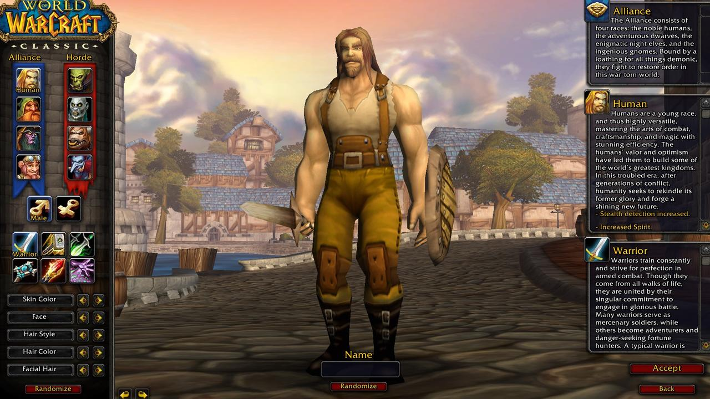

# **Hibridación tecnológica y cultural: MMORPG y emulación.**
---
## Introducción
---

## Caso 1 - MMORPG (Massive Multiplayer Online Rol Playable Game)

  

### Descripción
### Hibridación según Lev Manovich
---

## Caso 2 - Concepto de emulación

  

### Descripción
### Hibridación según Lev Manovich
---
## Conclusión
---
## Bibliografia
- Adell, F. (2013). *Remediación, multimedia e hibridación de los medios.* multimedia.uoc.edu.
- Rodríguez Martínez, M. (2016). *Diseño de emuladores híbridos con aplicación en circuitos caóticos.* ipicyt.repositorioinstitucional.mx.
- Manovich, L. (2008). *Comprender los medios híbridos.* academia.edu/2800625/Comprender_los_medios_h%C3%ADbridos
- Subirana, B., y Cabañas, M. (2007). *Videojuegos MMORPG: los escenarios virtuales impactan con fuerza en el mundo real*. EB Center. iese.edu/media/research/pdfs/ESTUDIO-59.pdf
