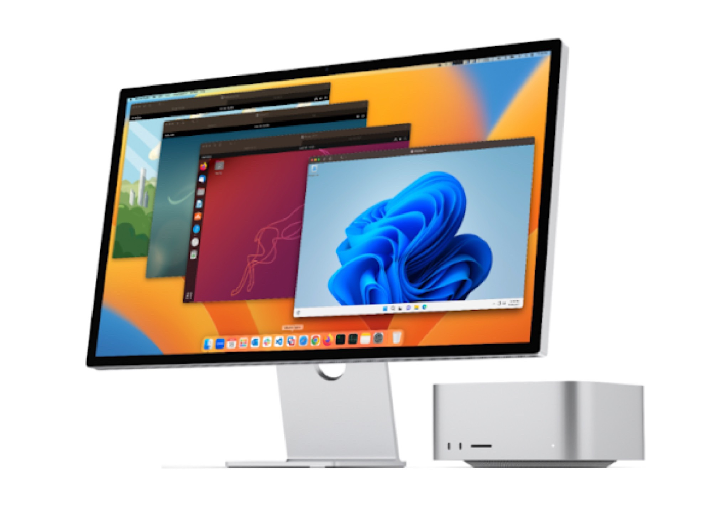

# **Hibridación tecnológica y cultural: MMORPG y emulación.**
### - Aitor Marcos Rodríguez Mármol
### - Grado en multimedia
### - 20/12/2024
### - Total palabras (contenido):

## Introducción
A lo largo de las páginas de El lenguaje de los nuevos medios de Lev Manovich, hemos analizado conceptos clave para entender las transformaciones culturales y tecnológicas de la era digital. Previamente abordamos el fenómeno de la remediación, ejemplificado a través de Twitch. Ahora, exploramos el concepto de hibridación, que implica la combinación de formas y medios diversos en un único objeto, interfaz o experiencia mediática.

Manovich entiende la hibridación como la integración de elementos, características y dinámicas de medios distintos, creando algo novedoso que no puede encasillarse en ninguno de los medios originales. Este concepto no solo implica una mezcla de tecnologías, sino también la confluencia de lógicas culturales, estéticas y comunicativas, transformando experiencias y estructuras mediáticas.

Examinaremos dos casos paradigmáticos: los MMORPG (Massively Multiplayer Online Role-Playing Games) y la emulación, que muestran cómo la hibridación redefine los límites entre medios, tecnologías y prácticas culturales.

## Caso 1 - MMORPG (Massive Multiplayer Online Rol Playable Game)

  
  
Pantalla de creación de personaje del MMORPG World of Warcraft: Classic (2024)

### Descripción

Para el análisis de este caso, utilizaremos el término emulación para referirnos a la reproducción de software obsoleto (A), recreación de entornos virtuales clásicos (B), mejora audiovisual mediante técnicas modernas (C), y creación de configuraciones personalizadas para usuarios (D). Estas características permiten revivir experiencias originales y adaptarlas a las posibilidades técnicas contemporáneas. Además, la emulación combina tecnologías retro con infraestructura moderna, eliminando las limitaciones del hardware original y extendiendo su alcance a nuevas generaciones. Este término, alineado con el concepto de hibridación de Lev Manovich, simplifica la redacción y destaca el fenómeno de convergencia que define este caso.

### Como concepto de hibridación

Las hibridaciones, según Lev Manovich, se reconocen cuando elementos de medios o tecnologías previamente independientes se combinan para crear algo nuevo, tanto en su forma como en su funcionalidad:
- La unión de elementos narrativos (como una trama compleja propia del cine o la literatura) con la interacción en tiempo real de múltiples jugadores.
- La incorporación de mundos persistentes que evolucionan con la interacción de los usuarios.
- La mezcla de gráficos avanzados con mecánicas de juegos de rol tradicionales, llevadas a plataformas en línea.
- El uso de interfaces específicas y concretas, diseñadas para maximizar la accesibilidad de los jugadores, integrando elementos de comunicación como chats de texto, sistemas de voz, y HUDs (Head-Up Displays) que facilitan la navegación y el intercambio de información entre los usuarios.

Los MMORPG (Massively Multiplayer Online Role-Playing Games) son plataformas digitales que permiten a miles de jugadores interactuar en tiempo real en mundos virtuales persistentes.

Medios que incorpora, ejemplificando una hibridación funcional y cultural, ya que:
- Narrativa cinematográfica: Historias envolventes propias del cine o la literatura.
- Gráficos avanzados: Representaciones visuales tridimensionales.
- Interacción social: Herramientas como chats de texto, sistemas de voz, clanes, y mecánicas de cooperación/competencia entre jugadores.
- Interfaces accesibles: Diseños intuitivos que incluyen mapas interactivos, sistemas de gestión de inventarios y notificaciones en tiempo real.
- Economía digital: Mercados internos con monedas virtuales y transacciones reales.
- Tecnología de red: Infraestructuras de servidores para el juego en línea.
- Identidad cultural: El sentido comunitario crea rasgos característicos arraigados a su entorno.

## Caso 2 - Concepto de emulación

  
  
MacOS emulando Windows 11, Ubuntu y otros SO desde un iMac (2024)

### Descripción

Para este análisis, utilizamos el término emulación para referirnos a la integración de software antiguo en dispositivos no previstos originalmente (A), la desvinculación de hardware y software (B), la manipulación del código y personalización de interfaces (C), y la creación de entornos de testeo aislados (D). Esta hibridación permite revivir experiencias pasadas adaptándolas a la tecnología actual, combinando elementos clásicos con infraestructuras modernas para extender su vida útil y accesibilidad.

Esto diferencia la emulación de la multimedia, que combina medios sin alterar su estructura original, y de la remediación, que adapta un medio sin fusionar funcionalidades; en contraste, la emulación redefine las experiencias originales al mezclar elementos técnicos y culturales.

### Como concepto de hibridación

Medios que incorpora:
La emulación se refiere a la reproducción de hardware o software antiguo en dispositivos modernos, como consolas retro emuladas en PC, smartphones o dispositivos dedicados.

- Representación gráfica y sonora: Reproducción fiel de elementos audiovisuales originales, con opciones modernas como filtros o mejoras de resolución.
- Interactividad: Uso de controladores modernos o simulación de periféricos clásicos.
- Desvinculación de hardware y software: La emulación elimina la necesidad del hardware original, permitiendo que los programas antiguos funcionen en arquitecturas modernas.
- Interfaces accesibles: Configuraciones avanzadas de mapeo de controles, estados de guardado instantáneos y menús optimizados para los usuarios actuales.
- Comunicación digital: Capacidades para compartir ROMs, mods y experiencias personalizadas en comunidades en línea.
- Tecnología híbrida: Uso de software que simula el comportamiento del hardware original mediante traducción de instrucciones o interpretación binaria en tiempo real.

Según Manovich, la emulación representa una hibridación tecnológica y cultural, ya que:

- Elimina las barreras entre hardware y software, permitiendo que tecnologías actuales ejecuten programas diseñados para arquitecturas específicas y obsoletas.
- Fusiona herramientas modernas (como procesadores actuales) con tecnologías de retrocompatibilidad, combinando precisión técnica con accesibilidad masiva.
- Recupera lo retro o considerado obsoleto para nuevas generaciones mediante herramientas contemporáneas, promoviendo la preservación digital y la innovación.
- Fomenta una convergencia cultural al permitir la experimentación creativa de los usuarios con juegos clásicos a través de mods o comunidades especializadas.

## Valoración personal

Mientras que los MMORPG abren puertas a mundos completamente nuevos, donde la tecnología y la interacción social se combinan para crear experiencias innovadoras, la emulación se enfoca en algo diferente: revitalizar lo antiguo y garantizar una compatibilidad casi universal donde hardware y software se desvinculan. Al desvincular el software de su hardware original, la emulación nos permite revivir experiencias pasadas, preservando su esencia y al mismo tiempo adaptándolas a los avances tecnológicos actuales.

Ambos casos me parecen fascinantes porque logran integrar lo técnico y lo cultural de manera única, pero desde enfoques opuestos. Los MMORPG crean un futuro lleno de posibilidades, mientras que la emulación mira hacia el pasado, buscando mantener vivo el legado digital. Esta dualidad refleja cómo la tecnología puede tanto crear algo completamente nuevo como preservar lo que ya existe, dándole un nuevo valor.

## Bibliografia
- Adell, F. (2013). *Remediación, multimedia e hibridación de los medios.* multimedia.uoc.edu.
- Rodríguez Martínez, M. (2016). *Diseño de emuladores híbridos con aplicación en circuitos caóticos.* ipicyt.repositorioinstitucional.mx.
- Manovich, L. (2008). *Comprender los medios híbridos.* academia.edu/2800625/Comprender_los_medios_h%C3%ADbridos
- Subirana, B., y Cabañas, M. (2007). *Videojuegos MMORPG: los escenarios virtuales impactan con fuerza en el mundo real*. EB Center. iese.edu/media/research/pdfs/ESTUDIO-59.pdf
